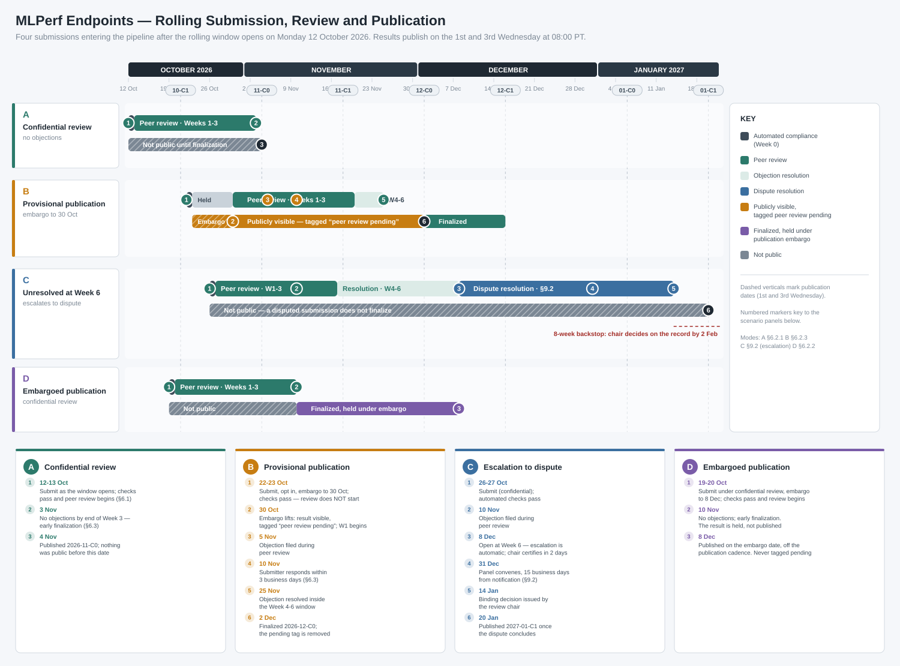

# MLPerf® Endpoints Submission Rules

*MLPerf Endpoints Rules Task Force — Version 1.0 Draft — 2026-05-05*

> [!NOTE]
> This document supplements and, where specified, overrides the
> [MLPerf® General Submission Rules](https://github.com/mlcommons/policies/blob/master/submission_rules.adoc)
> for the MLPerf Endpoints benchmark suite.
> Sections not explicitly overridden here inherit from the general rules without modification.

---

## Table of Contents

1. [Basics](#1-basics)
2. [Review Committee](#2-review-committee)
   - [2.1 Structure](#21-structure)
   - [2.2 Review Chair](#22-review-chair)
   - [2.3 Reviewer Obligations](#23-reviewer-obligations)
   - [2.4 Conflict of Interest](#24-conflict-of-interest)
   - [2.5 Confidential and Not Precedent Setting](#25-confidential-and-not-precedent-setting)
3. [Operating Principles](#3-operating-principles)
4. [Schedule](#4-schedule)
   - [4.1 Rolling Submission Model](#41-rolling-submission-model)
   - [4.2 Publication Cohorts and Embargo](#42-publication-cohorts-and-embargo)
   - [4.3 Submission-to-Publication Alignment](#43-submission-to-publication-alignment)
   - [4.4 Benchmark Roadmap](#44-benchmark-roadmap)
5. [Submission](#5-submission)
   - [5.1 Registration](#51-registration)
   - [5.2 How to Submit](#52-how-to-submit)
   - [5.3 Late Submissions](#53-late-submissions)
   - [5.4 Licensing](#54-licensing)
   - [5.5 Submission Content](#55-submission-content)
   - [5.6 system\_desc\_id.json Metadata](#56-system_desc_idjson-metadata)
   - [5.7 Logging Requirements](#57-logging-requirements)
   - [5.8 Compliance Testing](#58-compliance-testing)
6. [Review](#6-review)
   - [6.1 Automated Compliance (Week 0)](#61-automated-compliance-week-0)
   - [6.2 Provisional Publication](#62-provisional-publication)
   - [6.3 Peer Review (Weeks 1–3)](#63-peer-review-weeks-13)
   - [6.4 Objection Resolution (Weeks 4–6)](#64-objection-resolution-weeks-46)
   - [6.5 Review Timeline Summary](#65-review-timeline-summary)
   - [6.6 Late Objections (Post Week 6)](#66-late-objections-post-week-6)
   - [6.7 Filing Objections](#67-filing-objections)
   - [6.8 Types of Objections](#68-types-of-objections)
   - [6.9 No Dedicated Review Meetings](#69-no-dedicated-review-meetings)
   - [6.10 Visibility of Results During Review](#610-visibility-of-results-during-review)
   - [6.11 Withdrawing Results](#611-withdrawing-results)
7. [Publication](#7-publication)
   - [7.1 Results Categories](#71-results-categories)
   - [7.2 Available](#72-available)
   - [7.3 Preview](#73-preview)
   - [7.4 RDI (Research, Development, or Internal)](#74-rdi-research-development-or-internal)
   - [7.5 Open Question: Custom SKU Classification](#75-open-question-custom-sku-classification-custom-sku)
   - [7.6 Results Table Content](#76-results-table-content)
8. [Post-Publication](#8-post-publication)
   - [8.1 Pareto Updates](#81-pareto-updates)
   - [8.2 Corrections](#82-corrections)
   - [8.3 Withdrawal](#83-withdrawal)
   - [8.4 Terms of Use](#84-terms-of-use)
   - [8.5 Issues Discovered After Publication](#85-issues-discovered-after-publication)
9. [Dispute Resolution](#9-dispute-resolution)
   - [9.1 Scope](#91-scope)
   - [9.2 Escalation Path](#92-escalation-path)
   - [9.3 Remedies](#93-remedies)
   - [9.4 Appeal](#94-appeal)
   - [9.5 Status](#95-status)
10. [Audit Process](#10-audit-process)
11. [Appendices](#11-appendices)

---

## 1. Basics

These rules define the submission, review, and publication process for the MLPerf Endpoints benchmark suite. MLPerf Endpoints inherits the general principles of the [MLPerf® General Submission Rules](https://github.com/mlcommons/policies/blob/master/submission_rules.adoc) — including transparency, mandatory peer review, and objection-based quality control — but replaces the batch submission model with a *rolling submission model* suited to the faster cadence of Gen AI inference benchmarking.

Where this document conflicts with the MLPerf General Submission Rules, this document takes precedence for MLPerf Endpoints submissions.

Technical requirements — including benchmarks, metrics, the pareto collection methodology, and division-specific rules — are defined in the companion [MLPerf Endpoints Rules](endpoints_rules.md) document. Publication status categories and availability criteria are defined in [§7](#7-publication) of this document.

> [!NOTE]
> **Rule Stability.** These rules are *tentative* until the first MLPerf Endpoints submission round (v0.7) closes on **2026-06-19**. Sections explicitly marked **`[TENTATIVE — Subject to change after 2026-06-19]`** in either this document or in [`endpoints_rules.md`](endpoints_rules.md) are most likely to evolve between v0.7 and v0.8 (next submission **2026-09-01**, after which rolling submission begins) based on submitter feedback and working-group discussion. The traditional MLPerf Inference v6.1 round on **2026-07-31** runs in parallel and is unaffected by Endpoints rule changes. See [§4.0 v0.7 and v0.8 Submission Milestones](#40-v07-and-v08-submission-milestones) for the full milestone table.

The review process is designed to:

- **Publish results quickly.** Submitters and the industry should not have to wait months for results to appear. The rolling model targets rapid, bi-weekly publication.
- **Align publication to embargo dates.** Submitters may wish to have results become public on particular dates to align with launches, conferences, and other events.
- **Scale with workload.** Each submission may contain tens of measurement points (pareto curves), significantly more than a single-number inference submission. The process must handle this without proportionally increasing reviewer burden.
- **Avoid dedicated review meetings.** Reviews are conducted asynchronously via GitHub issues. Meetings are called only when disputes cannot be resolved offline.
- **Maintain credibility.** Early publication of results before peer review is completed is clearly labeled and carries mandatory disclaimers.

---

## 2. Review Committee

### 2.1 Structure

The review committee for a given cohort consists of representatives from organizations that have participated in MLPerf Endpoints within the preceding **6 months or 12 cohorts, whichever is longer**, counting backward from the first day of the publication month.

"Participated" means the organization has at least one MLPerf Endpoints result that has completed the full review process and been published without a "peer review pending" tag (i.e., finalized results). Results that were published but are still carrying the "peer review pending" tag do not count toward participation eligibility. Organizations whose only finalized results within the lookback period were subsequently withdrawn are not eligible for committee membership.

> **Example:** A submission published in the 2026-12-C1 cohort draws its review committee from organizations that submitted results published on or after 2026-06-01.

### 2.2 Review Chair

A standing review chair is selected every quarter. The chair does not need to be a member of the review committee and does not need to have participated in MLPerf Endpoints — they should be knowledgeable about MLPerf benchmarking processes and preferably neutral (i.e., not affiliated with an active Endpoints submitter). One co-chair is elected or nominated from the review committee every 3 months on a rotating basis.

> [!NOTE]
> **[WG Open Item]** — Should the review chair be required to be an MLCommons member? Arguments for: ensures familiarity with MLCommons processes and governance; provides accountability. Arguments against: limits the pool of qualified neutral candidates. The working group must decide before the first submission round.

Responsibilities of the chair and co-chair include:

- Monitoring the review pipeline and ensuring timely progress through review phases.
- Calling review committee meetings when disputes escalate (see [§9 Dispute Resolution](#9-dispute-resolution)).
- Certifying that submissions have completed the review process.
- Recusing themselves from review of their own organization's submissions (if applicable).

### 2.3 Reviewer Obligations

Review committee members are expected to participate in peer review of submissions within their area of expertise. There is no mandatory minimum number of reviews per member, but the committee is collectively responsible for ensuring all submissions receive adequate scrutiny within the review window.

### 2.4 Conflict of Interest

Committee members must recuse themselves from reviewing their own organization's submissions. Members may also voluntarily recuse on any other grounds. Recusals are recorded in the submission's GitHub issue thread.

For clarity: being a competitor is not a conflict of interest. The peer review model is inherently built on competitors reviewing each other's work. Similarly, CSP/OEM/ODM partnership relationships between the reviewer's and submitter's organizations do not constitute a conflict of interest. Conflicts of interest are limited to situations such as direct financial interest in a submission's outcome, employment relationships, or other circumstances that would compromise a reviewer's objectivity beyond normal competitive dynamics.

Submitters or other review committee members may raise conflict of interest concerns about a reviewer at any time during the review process. The review chair will evaluate the concern and determine whether recusal is warranted.

### 2.5 Confidential and Not Precedent Setting

*Inherits from [General Submission Rules §2.4](https://github.com/mlcommons/policies/blob/master/submission_rules.adoc#confidential-and-not-precedent-setting) without modification.*

---

## 3. Operating Principles

*Inherits from [General Submission Rules §3](https://github.com/mlcommons/policies/blob/master/submission_rules.adoc#operating-principles) without modification.*

MLPerf's purpose is to produce fair and useful benchmark results.

The MLPerf Endpoints review committee reserves the right to depart from these rules and/or exclude submissions that conflict with this purpose with a two-thirds (rounded up) vote by the submitters.

The role of the review process is to ensure fairness of submissions, not to litigate details in an effort to disqualify competitors.

---

## 4. Schedule

### 4.1 Rolling Submission Model

MLPerf Endpoints uses a **rolling submission model**. Submitters may submit on any day of the month — there is no fixed submission deadline. Each submission is timestamped upon receipt and enters the review pipeline immediately.

This section replaces the batch submission schedule defined in the MLPerf General Submission Rules §4 for MLPerf Endpoints submissions.

### 4.2 Publication Cohorts and Embargo

MLCommons publishes results on a bi-weekly cadence, on the **1st and 3rd Wednesday of each month at 8:00 AM Pacific Time**.

Each cohort is identified as:

- `YYYY-MM-C0` — published on the 1st Wednesday of the month at 8:00 AM PT.
- `YYYY-MM-C1` — published on the 3rd Wednesday of the month at 8:00 AM PT.

> **Example:** A submission received on a Monday could appear in the next Wednesday's cohort at the earliest, subject to passing automated compliance checks and the 1 business-day alignment window (see [§4.3](#43-submission-to-publication-alignment)).

#### Publication Embargo

Submitters may request that MLCommons hold publication of their results until a specific embargo date, declared at the time of submission.

- **For standard (confidential) submissions:** results are not public until review is complete. The embargo date delays public release of finalized results. Results may be embargoed for **up to 60 days after the completion of review**.
- **For provisional publication submissions** (see [§6.2](#62-provisional-publication)): the embargo date delays when the "peer review pending" result first becomes publicly visible, and may be set to any date before finalization of results.

Rules for embargoed submissions:

- The embargo date must be declared in the submission metadata.
- The full review process (automated compliance, peer review, objection resolution) proceeds normally under the embargo — the embargo only delays public release.
- The embargo date **may be changed after submission**, but any change must be broadcast immediately to all review committee members.
- All review committee members are informed of the embargo date.
- Results under embargo are published on the requested embargo date and are not tied to the regular cohort schedule.

### 4.3 Submission-to-Publication Alignment

A submission is eligible for the next cohort if it passes automated compliance checks (see [§6.1 Automated Compliance](#61-automated-compliance-week-1)) at least 1 business day before the Wednesday publication date. Submissions that do not clear automated checks in time roll to the following cohort.

All review timelines, update windows, and objection deadlines are anchored to the **cohort in which a submission first appears** — not the raw submission date.

### 4.4 Benchmark Roadmap

*Inherits from [General Submission Rules §4.3](https://github.com/mlcommons/policies/blob/master/submission_rules.adoc#benchmark-roadmap-schedule) without modification.*

### 4.5 Review Cycle Example

The figure below illustrates three representative scenarios for a submission made on **August 10, 2026** (Monday). It shows how automated checks, peer review, objection resolution, provisional publication, and cohort publication all interact across calendar time.

**Scenario 1 — Fails automated checks:** The submission is found non-compliant during Week 0 and is rejected. The submitter may correct and resubmit.

**Scenario 2 — Objections resolved in peer review:** Automated checks pass on August 12. An objection is filed August 21, responded to August 26, and fully resolved August 28 — before peer review closes on September 2. Early finalization applies; results publish in the **2026-09-C0** cohort.

**Scenario 3 — Provisional publication; objections carry into resolution:** The submitter opts in to provisional publication. Automated checks pass August 12; the "peer review pending" result becomes visible at the **2026-08-C1** cohort (August 19), running in parallel with peer review. An objection filed August 27 carries into the objection resolution window. The objector provides a validation schedule; resolution is confirmed September 9. Results are finalized in the **2026-09-C1** cohort (September 16), at which point the "peer review pending" tag is removed.

---

## 5. Submission

### 5.1 Registration

*Overrides General Submission Rules §5.1 (the eight-week advance registration requirement does not apply to rolling submissions).*

The **individual making the submission** must have signed the relevant MLCommons CLA. The CLA requirement applies to that individual — it is not required that every member of their organization has signed. 

The individual making the submission must register on the MLCommons PRISM portal and generate a submission token. The token must be provided as a CLI argument when invoking the submission command.

### 5.2 How to Submit

> [!NOTE]
> **[TBD — Pending MLCommons input]** — The exact submission mechanism (encrypted tarball, web UI, GitHub PR, or other) for MLPerf Endpoints has not yet been finalized. MLCommons needs to specify the tooling and infrastructure. The following text reflects the approach used for MLPerf Inference and will be updated once the Endpoints submission tooling is defined.

A submission is made by placing an encrypted tarball in an MLCommons-provided cloud storage bucket and confirming the submission using the MLCommons web UI, following the process described in [General Submission Rules §5.2](https://github.com/mlcommons/policies/blob/master/submission_rules.adoc#how-to-submit).

The submission must include all materials required by the [MLPerf Endpoints Rules](endpoints_rules.md) document.

### 5.3 Late Submissions

The "late submissions" provisions of the General Submission Rules §5.3 do not apply to MLPerf Endpoints, as there is no fixed submission deadline.

### 5.4 Licensing

*Inherits from [General Submission Rules §5.4](https://github.com/mlcommons/policies/blob/master/submission_rules.adoc#licensing) without modification.*

All submissions of code must be made under the MLCommons CLA. Per the CLA, all submissions of code will be Apache 2 compatible. Third party libraries need not be Apache 2 licensed.

### 5.5 Submission Content

A submission must contain the following:

- Metadata for the system under test (`system_desc_id.json`).
- Pareto curve YAML configuration files (one per measurement point).
- Run result artifacts for each measurement point (log files, metric summaries).
- Accuracy validation run artifacts.
- Code that implements the benchmark endpoint interface.
- Metadata describing the system-implementation combination tested.

Full content and directory structure requirements are defined in [MLPerf Endpoints Rules §7](endpoints_rules.md#7-submission-requirements).

### 5.6 `system_desc_id.json` Metadata

In addition to the standard fields defined in [General Submission Rules §5.7](https://github.com/mlcommons/policies/blob/master/submission_rules.adoc#system_desc_id-json-metadata), Endpoints submissions must include:

| Field | Description |
|---|---|
| `division` | One of `Standardized`, `Serviced`, or `RDI`. |
| `publication_status` | One of `Available`, `Preview`, or `RDI`. |
| `benchmark_model` | The benchmark model name (e.g., `llama3-70b`). |
| `max_supported_concurrency` | The declared Maximum Supported Concurrency `M`. |
| `endpoint_url` | URL or description of the inference endpoint under test. |
| `serving_framework` | Inference serving framework and version (e.g., `vLLM 0.4.0`). |

### 5.7 Logging Requirements

Results logs must be produced by the MLPerf Endpoints reference client using the `ConcurrencyScheduler` load pattern. Per-run artifacts must conform to the MLPerf Endpoints data dictionary.

### 5.8 Compliance Testing

Submitters must run the automated compliance validator prior to submission. The compliance validator checks pareto structure, run requirements, accuracy, and metadata as described in [MLPerf Endpoints Rules §9](endpoints_rules.md#9-compliance-validation).

---

## 6. Review

### 6.1 Automated Compliance (Week 0)

Automated compliance checks are executed immediately after submission. The checks must complete within **one calendar week (Week 0)**, but may complete much sooner — as quickly as one day depending on submission size and queue depth. These checks verify:

- All required submission materials are present (YAML configurations, result artifacts, system descriptions).
- The pareto curve satisfies minimum point count and region coverage requirements (minimum 7 points structured as 1 + 3 + 3; maximum 32 points total).
- Run durations, minimum query counts, load patterns, and streaming configuration meet requirements.
- Accuracy validation results are included and pass the quality target.
- Metric consistency (e.g., `system_tps` derivable from total tokens and elapsed duration; `tps_per_user = system_tps / concurrency`).
- Configuration consistency across measurement points (same model, same endpoint, same software stack).

The full list of automated checks is defined in [MLPerf Endpoints Rules §9](endpoints_rules.md#9-compliance-validation).

**If a submission fails any automated check by the end of Week 0, it is rejected.** The submitter is notified of the specific failures and may correct the issues and resubmit as a new submission. Rejected submissions do not enter the peer review phase. The peer review period begins as soon as all automated checks have passed.

### 6.2 Provisional Publication

By default, submissions enter a **fully confidential review cycle**: results and artifacts are visible to the review committee and other submitters, but are not published publicly until the review is complete (all objections resolved, no pending objections remaining). Results are published in the first cohort after finalization.

#### Opting In to Provisional Publication

Submitters may **opt in** to provisional publication at the time of submission. If a submitter opts in:

- Results are published before peer review completes, carrying a **"peer review pending"** tag. This allows submitters to reference new results in time-sensitive contexts — such as keynote presentations, product launches, and press briefings — without waiting for the full review cycle.
- The review committee is informed of the opt-in at the start of the review cycle.

The opt-in choice is irrevocable after submission. Submitters who do not opt in may not subsequently request provisional publication of those results.

#### Embargo for Provisional Publication

Submitters who opt in to provisional publication may additionally declare an **embargo date** — a hold on when the "peer review pending" result first becomes publicly visible. The embargo date may be any date before the finalization of results. See [§4.2](#42-publication-cohorts-and-embargo) for general embargo rules, including how to change the embargo date after submission.

> [!IMPORTANT]
> Any reference to results carrying the "peer review pending" tag — by MLCommons, submitters, press, or third parties — must include the standard MLCommons footnote stating that results are **preliminary and subject to change** pending peer review. The exact footnote text is defined in the MLPerf Results Messaging Guidelines.

### 6.3 Peer Review (Weeks 1–3)

Once automated compliance checks pass, the submission enters the peer review phase, which runs through the end of Week 3. Review committee members may:

- Examine the submission materials, run logs, and configuration files.
- File objections as GitHub issues on the submission repository (see [§6.7 Filing Objections](#67-filing-objections)).
- Request clarification from the submitter via the issue thread.

**No new objections may be filed after the close of the peer review window (end of Week 3).** Objections not filed during this window are not eligible for the objection resolution phase and may only be raised through the late objection process (see [§6.6](#66-late-objections-post-week-6)).

**Response timelines within the peer review window:**

- Once an objection is filed, the **submitter must post an initial response within 3 business days**, counting from the day the objection is filed. Business day counting accounts for local public holidays in the submitter's primary operating jurisdiction — days falling on a local holiday do not count against the window. The response must either acknowledge the issue and include a **schedule for resolution** — which may extend into the objection resolution window if needed — or contest the objection with a counter-argument and supporting evidence.
- After the submitter responds, the **objecting party has 2 business days** to acknowledge the response, retract the objection, or indicate that the issue remains unresolved and will carry into the objection resolution window. The objecting party may also provide a **schedule or timeline** for testing and validating the proposed resolution, in which case the objection remains open until that validation is complete or the stated timeline has elapsed.

**Submitter non-response penalties.** Failure to respond to a filed objection triggers automatic penalties based on elapsed business days since the objection was filed. Business day counting follows the same local holiday rule as the response window. These penalties apply throughout both the peer review and objection resolution windows and are enforced by the review chair without requiring a separate motion.

| Business days elapsed without submitter response | Penalty |
|---|---|
| 3 business days | Results finalization is automatically delayed by **1 publication cohort**. |
| 6 business days | Delay increases to **2 publication cohorts**. |
| 10 business days | The submission is **withdrawn**. The submitter may correct the issues and resubmit as a new submission. |

Penalties are cumulative and non-reversible — responding after a penalty threshold has been crossed does not remove the penalty, though subsequent response may prevent further escalation. The review chair must notify the submitter and all review committee members when a penalty threshold is crossed.

**Early finalization.** Objections may be fully resolved during the peer review window. If all objections are resolved or retracted before the end of Week 3, the submission is eligible for **early finalization** — it does not need to wait for the close of the objection resolution window. The review chair certifies early finalization and the submission is queued for the next available cohort.

### 6.4 Objection Resolution (Weeks 4–6)

From Week 4 through Week 6, all filed objections carried over from the peer review window must be resolved. All objections must reach resolution; escalation to dispute resolution is reserved for cases where the parties cannot agree on the facts or interpretation.

**Response timelines within the resolution window:**

- For each open objection entering the resolution window, the **submitter must provide a fix or formal resolution response within 3 business days**, accounting for local holidays, consistent with the resolution schedule declared during peer review. Non-response penalties from [§6.3](#63-peer-review-weeks-13) continue to apply.
- After the submitter's resolution response, the **objecting party has 2 business days** to either acknowledge resolution, explicitly explain — with specificity — why the response is not sufficient to close the objection, or provide a **schedule or timeline** for testing and validating the resolution. Silence after 3 business days is treated as acknowledgment of resolution and the objection is automatically retracted.
- If the review chair determines that a resolution timeline is not being met, they may intervene to set a binding deadline or call a resolution meeting.

**Meeting escalation.** If an objection is not close to resolution **12 business days after it was first filed**, or if any open objection is entering Week 5 of the review cycle, the review chairs may call a meeting with the relevant parties to expedite and close the issue. Attendance at such a meeting is expected of both the objector and the submitter.

An objection is considered resolved when:

- The submitter addresses the concern to the objecting party's satisfaction, or
- The review chair determines the objection is not substantiated, or
- The objecting party retracts the objection, or
- The objecting party does not respond within 3 business days of the submitter's resolution response.

Unresolved objections at the end of Week 6 are escalated to the dispute resolution process (see [§9](#9-dispute-resolution)).

Once all objections are resolved or retracted, the "peer review pending" tag is removed and the submission's results are finalized.

### 6.5 Review Timeline Summary

| Phase | Window | Key Actions |
|---|---|---|
| Automated Compliance | Week 0 (up to 1 week; may complete in as little as 1 day) | Automated checks run. Pass → advances to peer review immediately. Fail by end of Week 0 → **rejected**; submitter may resubmit. Results remain confidential by default; provisional publication if submitter opted in (subject to embargo). |
| Peer Review | Weeks 1–3 | Committee reviews; objections filed via GitHub (no new objections after end of Week 3); submitter has 3 business days (local holidays exempt) to respond with a resolution schedule; non-response penalties: +1 cohort at 3 biz days, +2 cohorts at 6, withdrawn at 10; objector has 2 business days to respond or provide a validation schedule. If all objections resolved before end of Week 3 → eligible for early finalization. |
| Objection Resolution | Weeks 4–6 | Open objections must be resolved; same non-response penalty schedule applies; objector has 2 business days to explain insufficiency or provide validation schedule (silence = objection retracted after 3 days); chairs may call meeting if objection is 12+ biz days old or entering Week 5; submission finalized or escalated to dispute resolution. |
| Late Objections ⚠️ | Post Week 6 | Availability and validity objections only via dispute resolution process. **[WIP — pending WG approval]** |

### 6.6 Late Objections (Post Week 6)

> [!WARNING]
> **[WIP — Pending Working Group Approval]** — The late objection policy is under active discussion and has not yet been ratified by the working group. The grounds, process, and time limits described below are a current proposal and are subject to change.

After Week 6, late objections may be raised only on the following grounds:

- **Availability** — the system does not meet the availability status claimed at submission.
- **Validity** — specific metric values are found to be incorrect or inconsistent with known hardware capabilities.

Late objections are handled through the dispute resolution process (see [§9](#9-dispute-resolution)).

#### Reproducibility Expectations

Perfect reproducibility of results cannot be reasonably expected and must not be used to block publication unless the deviation is egregious. Due to natural variability in silicon, machine configuration, setup, power delivery, cooling, and thermal state, **a performance variability of up to 10% is expected and allowed** during the review period. Large-scale submissions (hundreds of accelerators) may exhibit even higher variance and should be assessed with proportionally greater tolerance.

The only exception is same-system reproducibility: when re-running on the **exact same system** (e.g., during an audit), results must be **within 5%** of the original submission.

**Accuracy must always pass** — the accuracy quality target is a hard gate with no variability allowance, both during automated compliance and throughout the review period.

> [!NOTE]
> **[WG Decision Required]** — The 10% performance variability margin and the 5% same-system threshold are current proposals and must be ratified by the working group before they can be enforced. The working group should consider whether different margins apply to different metric types (e.g., TTFT vs. system TPS) and whether large-scale submission thresholds need separate treatment.

### 6.7 Filing Objections

Objections must be filed as GitHub issues on the submission repository before the end of Week 3. Each objection must:

- Cite the specific offending material (log excerpts, configuration values, reproduction attempts).
- Reference the applicable rule or section number.
- Include a `by <org>` tag and an `against <org>` tag.

Multiple organizations may append their `by <org>` to an existing objection. An objector who determines their objection is in error may remove their `by <org>` tag. All objections with no `by <org>` tags at the close of the peer review window will be closed.

### 6.8 Types of Objections

Objections filed during peer review must be categorized as one of the following types. All objections must cite specific evidence (log excerpts, configuration values, reproduction attempts) and reference the applicable rule or section.

| Type | Description | Severity |
|---|---|---|
| **Compliance Failure** | Submission does not meet stated rules (point count, region coverage, run duration, load pattern, etc.). | High — may require withdrawal. |
| **Methodology** | Disagreement with how the benchmark was configured or executed (e.g., dataset handling, warmup procedure). | High. |
| **Reproducibility** | Results cannot be reproduced by an independent party or appear statistically implausible. A reproducibility objection must demonstrate deviation beyond the allowed variability margin (see [§6.6 Reproducibility Expectations](#reproducibility-expectations)). Minor deviations within the expected range are not grounds for blocking publication. Accuracy failures are always a valid reproducibility objection regardless of margin. Reproducibility objections must be filed during the peer review window — they are not eligible as late objections after week 7. | High — but must exceed the allowed variability margin to be actionable. |
| **Validity of Results** | Specific metric values appear incorrect, inconsistent, or incompatible with known hardware capabilities. | High. |
| **Division Rules** | Submission placed in wrong division, or system does not meet division requirements (availability, API compliance, etc.). The review committee may allow the submitting organization to reclassify to the correct division rather than withdraw. | Medium. |
| **Availability** | System claimed as Available or Preview does not meet the availability requirements at the stated date. The review committee may allow the submitting organization to reclassify (e.g., from Available to Preview or RDI) rather than withdraw. | Medium. |
| **Suspect or Incomprehensible Results** | Results are anomalous or unexplainable but no specific rule violation can be identified. Triggers an investigation. | Medium. |
| **Cosmetic** | Formatting errors, metadata issues, or presentation problems that do not affect scores. Does not block finalization. | Low. |

### 6.9 No Dedicated Review Meetings

Standing review meetings are not required. All peer review is conducted asynchronously via GitHub issues. Meetings are convened only when:

- An objection is escalated to the dispute resolution process.
- A submitter or committee member explicitly requests a meeting to resolve a specific issue.
- The review chair determines that a meeting would materially accelerate resolution.

Meeting requests must include a written agenda and specific questions to be addressed.

### 6.10 Visibility of Results During Review

*Overrides [General Submission Rules §6.1](https://github.com/mlcommons/policies/blob/master/submission_rules.adoc#visibility-of-results-and-code-during-review).*

| Group | During Review (Weeks 1–6) | After Finalization |
|---|---|---|
| Review committee | All results, all code, all run artifacts. | All results, all code, all run artifacts. |
| Submitters | All results, all code, all run artifacts. | All results, all code, all run artifacts. |
| Public | Results carrying the "peer review pending" tag only (for submissions that have opted in to provisional publication, once any declared embargo has lifted). No access to code or submission artifacts. | All results, all code, all submission artifacts. |

For submissions that have not opted in to provisional publication (see [§6.2](#62-provisional-publication)), the public has no visibility until results are finalized.

### 6.11 Withdrawing Results

A submission may be withdrawn at any time up until finalization. Post-finalization withdrawals are handled per [§8.3 Withdrawal](#83-withdrawal).

---

## 7. Publication

MLCommons publishes all results per the bi-weekly cadence defined in [§4.2 Publication Cohorts and Embargo](#42-publication-cohorts-and-embargo). After publication, code and results are public and free for use under the MLPerf Terms of Use.

### 7.1 Results Categories

*Overrides [General Submission Rules §7.3](https://github.com/mlcommons/policies/blob/master/submission_rules.adoc#results-categories).*

Results are divided into three publication status categories based on the availability of the hardware and software components at the time of submission.

| Category | Hardware | Software |
|---|---|---|
| **Available** | All components meet the four-point availability test at submission time. | Available software stack. |
| **Preview** | Does not yet qualify as Available; submitter commits to Available status within 180 days. | Available except software supporting substantially new hardware. |
| **RDI** (Research, Development, or Internal) | Does not meet Available or Preview requirements. | Does not meet Available or Preview requirements. |

An RDI component may not be submitted as Available or Preview until the cohort after next, or **221 days** after first publication as RDI, whichever is longer.

### 7.2 Available

A system is **Available** if all of its components that substantially determine ML performance meet the following four-point test at the time of submission:

| # | Criterion | Requirements |
|---|---|---|
| 1 | **Pricing** | Pricing is available — either publicly advertised or available upon request. |
| 2 | **Shipment** | The component or system has been shipped to or rented by at least one third party. |
| 3 | **Public Evidence** | There is externally verifiable public evidence that the component is actually shipping or available to purchase *today* — not merely announced, previewed, or soft-launched. See [§7.2.1](#721-public-evidence--proof-of-shipment-not-announcement) below. |
| 4 | **Reasonably Available** | The component or system is reasonably available for purchase or rent by additional third parties by the submission date. See [§7.2.2](#722-reasonably-available) below. |

**Assessing availability — preponderance of evidence.** Availability is a judgment call and no single data point is conclusive. The review committee evaluates availability based on the totality of available positive and negative signals. Signals indicating a product is likely available include: a sales representative actively willing to take orders; pricing on the vendor's website or obtainable on request; customer case studies referencing the product as deployed; official press releases confirming the product is *shipping*. In case of conflicting information, a vendor is not penalized for uneven availability across geographies or channels, provided availability exists in at least one market.

#### 7.2.1 Public Evidence — Proof of Shipment, Not Announcement

Evidence must prove the component is actually shipping or orderable *today* — not just announced. The following are **not sufficient** on their own:

- Announcements at a conference, trade show, or keynote.
- Product listings on a marketing or "coming soon" website.
- Soft-launch press releases or blog posts describing a future availability date.
- A "Preview" or "coming soon" entry in a cloud provider's product catalog.
- A stated or anticipated launch date without accompanying proof of current availability.

Evidence that *is* sufficient includes:

- Clearly listed availability on the vendor's official product or pricing page showing a live, functional call to action for qualifying customers (e.g., "Buy now," "Order," "Get started," or equivalent purchasing language — these are examples; other terms indicating an active, orderable listing are acceptable).
- Public claims by the vendor explicitly stating the product is "now shipping," "generally available," or "in production" — in a press release, earnings call, official blog post, or equivalent public statement.
- Publicly verifiable fulfillment data (a cloud provider's instance type appearing in live pricing and availability APIs, orderable by any qualifying customer).
- Third-party review units or press loaner systems confirmed by the recipient.
- Public purchase orders or customer shipment confirmations available in securities filings or regulatory disclosures.

For **component vendors** (accelerators, ASICs, memory, networking): the criterion is assessed from the component's position in the supply chain. The component must be available to ship to system integrators, OEMs, and ODMs under standard commercial terms.

**Custom SKUs.** See [§7.5](#75-custom-sku-classification-custom-sku) for the rules governing custom SKUs and hardware in large-scale production that is not available to all comparable customers.

**Vendor's own GA definition.** If the submitting organization has a formal internal process that defines when a product is generally available (e.g., "open shipping status," "phase 4 exit," "FCS"), the submitted system must satisfy that internal definition *in addition to* all criteria above.

#### 7.2.2 Reasonably Available

"Reasonably available" means the system or component is purchasable or rentable by any qualifying customer on commercially reasonable terms, including:

1. **Non-discrimination.** Competitors must not be blocked from purchasing or renting the system. All software, drivers, firmware, and support services made available to any customer must be made available to any other qualifying customer, including direct competitors, on equivalent terms.
2. **Access conditions.** Access to rent or purchase may be subject to conditions common to generally available products (financial qualifications, size of customer, support burden, export restrictions) but is not otherwise restricted — no "early access" approval requirements.
3. **Supply and lead times.** Supply and lead times are subject to market conditions and demand at the time of purchase; they are not governed by these rules and are not required to be fixed or guaranteed. MLPerf reproducibility does not confer any priority slot or allocation right — a reviewer or auditor wishing to reproduce results is subject to the same supply and demand constraints as any other customer. Individual components and entire systems may be subject to supply-demand constraints appropriate to their scale and market.

However, it is allowed for the qualifying pre-submission rentals or purchases to have been made with restrictions such as "early access" approval.

#### 7.2.3 Available Software Stack

An **Available** system must use an **Available** software stack — the set of software components that substantially determine ML performance but are not in the uploaded source code (e.g., the inference framework, ML accelerator library, kernel-level drivers).

| Category | Examples | Availability Rule |
|---|---|---|
| **ML frameworks** | PyTorch, TensorFlow, JAX | Any commit in an official public repository. Open PRs that add architecture support are permitted, provided the PR is publicly accessible. |
| **Inference servers** | TensorRT-LLM, vLLM, SGLang, Triton | Open-source: any public commit + accessible open PRs. Commercial: official release or labeled beta in the formal release sequence (see below). |
| **Accelerator compute libraries** | cuDNN, cuBLAS, NCCL, ROCm HIP | Official release or publicly available labeled beta in the formal release sequence. One-off private binary drops shared only with specific customers do not qualify. |
| **Hardware drivers** | CUDA driver, ROCm driver, NIC firmware | Official release or publicly available beta, downloadable through a standard vendor channel at the time of submission. |
| **Quantization / optimization tools** | bitsandbytes, AutoAWQ, llama.cpp, GPTQ | Same rules as ML frameworks if open-source; same rules as accelerator compute libraries if closed-source binary. |
| **Custom OS / kernel patches** | Custom Linux kernel builds, BIOS/firmware | Exempt if unmodified commodity software. Custom patches that substantially affect ML performance must be in an upstream-merged commit or publicly accessible PR. Private patches are not permitted. |
| **Submission code / custom kernels** | Custom CUDA kernels, Flash Attention variants | Not part of the software stack — must be included in the submitted source code package. |

**Labeled beta qualification.** A closed-source binary may qualify as Available if it is a labeled beta in the formal release sequence, provided: (1) the vendor has publicly committed that the optimizations will be included in a future official release; (2) the beta is offered to customers as a standard step in the release process — not a one-off private engagement; and (3) the beta is publicly downloadable at the time of submission. A release candidate satisfying these criteria qualifies; an engineering sample under NDA distributed to selected partners does not.

Software must be available at the time of **submission**. If a software component becomes unavailable between submission and publication, the submitter must notify the review committee. The committee may allow the submission to proceed if an equivalent public release is available, or may require reclassification.

#### 7.2.4 Available Models

The model weights and tokenizer used in the submission must be available through commercially accessible channels (e.g., a public model hub under a commercially permissive license, a vendor model download portal, or inclusion in the software product).

Model weights distributed under licenses that prohibit commercial deployment do not qualify the system as Available. Such submissions must be classified as Preview or RDI.

#### 7.2.5 Division-Specific Available Requirements

**Standardized division.** Hardware, software stack, and model must all meet §7.2.1–7.2.4. For CoN submissions, the endpoint URL must remain accessible for at least **90 days** after publication to support reproducibility verification; submitters must provide a point of contact for access requests during this period.

**Serviced division.** The endpoint must be at **full GA tier** — not a "Public Preview," "Open Beta," or "Generally Available in Preview" tier, even if publicly accessible. Preview-tier endpoints typically lack SLA commitments, may be subject to breaking changes, and may be withdrawn without notice; they do not represent the provider's full production commitment. Where the provider's own internal GA definition draws a distinction between preview-accessible and production-GA, the production-GA designation is required.

The **endpoint URL submitted for benchmarking must be the same endpoint that any paying customer uses in production.** Submitters may not use a capacity-reserved, dedicated, or otherwise privileged endpoint not available to the general public (e.g., a dedicated inference cluster standing up only for the benchmark run, or an internally hosted mirror with relaxed rate limits). Submissions found to have used non-public or specially provisioned endpoints are subject to withdrawal regardless of when the discovery is made.

The endpoint's **terms of service must permit benchmarking** by third parties. Any MLCommons member in good standing must be able to independently access the endpoint under standard terms and attempt to reproduce the published results. A Serviced submission whose ToS prohibits competitive benchmarking or automated performance testing does not qualify for Available status. Submitters must confirm at submission time that no provision of their ToS, acceptable use policy, or rate-limiting policies would prevent a member from conducting a good-faith reproducibility test.

**RDI division.** RDI division submissions carry RDI publication status and cannot qualify as Available or Preview. If the system subsequently becomes commercially available, the submitter must create a new Standardized or Serviced submission.

### 7.3 Preview

A **Preview** system does not qualify as Available at the time of submission, but the submitter commits to making it Available within **180 days** of its first publication in MLPerf Endpoints, and commits to re-submitting as Available at that time.

Preview results are published with a **"Preview — Available by [date]"** tag. If the system does not achieve Available status within the 180-day window, the result is automatically invalidated.

#### 7.3.1 Preview Window and Clock

- **Clock start:** The date of the cohort in which the result *first appears* — not the raw submission date.
- **Clock duration:** 180 calendar days from the clock start.
- **Clock anchor:** Anchored to the first publication date. Pareto updates, corrections, or system description amendments do not reset the clock.

*Example:* A result first published in the 2026-04-C1 cycle (April 30, 2026) has an availability deadline of October 27, 2026.

#### 7.3.2 Software Waiver for Preview

The Available software stack requirement (§7.2.3) is waived for software components necessary to support **newly developed hardware** that substantially determines ML performance (e.g., a new ML accelerator). "Newly developed" means the hardware was not Available as of the previous cohort and was not submitted as Preview in that cohort. All other software stack components must still meet the Available requirements.

#### 7.3.3 Performance Continuity Requirement

When a Preview submission transitions to Available, the re-submitted result must achieve equal or better performance compared to the Preview result. A degradation of up to **5%** is accepted to account for variance inherent to endpoints workloads — the high-interactivity region of the throughput–latency curve is sensitive to load-generation noise, and large-scale systems exhibit higher run-to-run variance than traditional batch inference.

> [!NOTE]
> **[WG Approval Required]** — The 5% Preview-to-Available margin is a proposal pending working group ratification. Until approved, treat this as provisional and flag any results that pass only under the 5% (vs. 2%) threshold.
> Approved by TaskForce 

The tolerance applies to each reported metric independently.

#### 7.3.4 Declaration Requirements

Submitters claiming Preview status must, at submission time:

1. Set `"availability_status": "preview"` in the system description.
2. State a `"target_availability_date"` within the 180-day window as an ISO 8601 date.
3. Identify **with specificity** which components are not yet available — e.g., *"The X100 GPU is expected to begin customer shipments in Q3 2026."* Vague statements such as *"targeting H2 2026"* are not sufficient.

#### 7.3.5 Preview Tracker and Expiration

MLCommons maintains a **Preview Availability Tracker** — a public document listing all active Preview results, their first publication dates, target availability dates, and days remaining. It is updated with each cohort.

At expiration of the 180-day window:

- **Available re-submission published:** Preview result is superseded by the Available result.
- **No re-submission, no extension:** Preview result is **invalidated** and removed at the next cohort. Invalidated results are not archived — they are removed.
- **Approved extension in force:** Result remains under Preview status for the extended period.

#### 7.3.6 Extensions

A **one-time extension of up to 60 calendar days** may be granted by the review chair, subject to:

- Request submitted at least **30 days before the expiration date**.
- Written explanation of the delay and a revised, specific availability date within the extended window.
- Only one extension is permitted per submission. A second extension will be denied; the result will be invalidated. The submitter may re-submit under RDI.

#### 7.3.7 Transition to Available

When a Preview system achieves commercial availability:

1. The submitter notifies the review committee via a GitHub issue on the submission thread.
2. The submitter makes a new Available submission with updated system description (`"availability_status": "available"`, `"availability_url"` pointing to a public product or ordering page).
3. The new submission follows the standard automated compliance and peer review process.
4. If the hardware or software configuration changed materially between Preview and GA, the submitter must re-run the benchmarks. Relabeling an existing Preview result as Available without re-running is not permitted if the configuration changed.
5. Upon successful review, the Available result is published in the next cycle and the Preview result is retired.

#### 7.3.8 Permitted Uses of Preview Results

Preview results may be referenced in public communications subject to the standard MLCommons footnote:

> *"MLPerf™ name and logo are trademarks of MLCommons. Results are preliminary — peer review pending. For more information, see mlcommons.org."*

All external references must use the qualified designation **"MLPerf Endpoints Preview."** Omitting the "Preview" qualifier when referencing an unfinalized result is a violation of MLCommons usage guidelines.

---
### 7.4 RDI (Research, Development, or Internal)

An **RDI** system contains one or more components that do not meet the Available or Preview criteria. There is no commitment or timeline associated with RDI status.

#### RDI Cooling-Off Period

An RDI component may not be submitted as Available or Preview until the later of:

- The cohort after next (i.e., at least two cohorts after the RDI submission), or
- **221 days** after first publication as RDI.

This cooling-off period prevents misuse of RDI status to pre-publish results on unavailable hardware and then immediately reclassify as Available.

### 7.5 Custom SKU Classification \[CUSTOM-SKU\]

#### Custom SKUs That Qualify as Available

Vendors, OEMs, and ODMs may qualify custom SKUs as **Available**, including SKUs manufactured exclusively for specific large-volume customers (e.g., custom silicon variants produced at scale for a hyperscaler or strategic customer). A custom SKU qualifies as Available if all three conditions are met:

1. The SKU has shipped to at least one customer.
2. The SKU is available to purchase by similar customers (e.g., other hyperscalers or large-volume customers) at a volume determined by the vendor, with customizations available upon request if warranted by the customer's requirements.
3. The differences between the custom SKU and any standard SKU are clearly and publicly documented by the vendor.

#### Open Question: Hardware Not Orderable by Any Comparable Customer

> [!NOTE]
> **[WG Open Item]** — How should we classify hardware that is in production at hyperscalers or strategic customers but is **not available** to any comparable customer for purchase?
>
> These systems do not qualify as **Available** under the custom SKU path above (they fail criterion 2 — no comparable customer can order them), and do not qualify as **Preview** (there may be no commitment to general availability). However, they are not prototypes or research hardware in the traditional RDI sense — the silicon is in production and shipping at volume.
>
> **Proposed options under working group consideration:**
>
> 1. **Classify as RDI** — current default under these rules. Applies the 221-day cooling-off for future Available resubmission.
> 2. **Create a new "Production" tier** — hardware that is in production but not generally orderable. This tier would sit between Available and RDI, without a cooling-off period, and with appropriate disclosure requirements.
>
> Until a decision is made, hardware shipping only to select strategic customers with no comparable ordering path defaults to **RDI** classification.

### 7.6 Results Table Content

Each results publication includes:

- Submitter organization and system description.
- Benchmark model.
- Division (`Standardized` / `Serviced` / `RDI`).
- Publication status (`Available` / `Preview` / `RDI`).
- Pareto curve in step-function representation.
- Key metrics at each submitted concurrency level: **System Tokens/Second** (`system_tps`), **TPS/User** (`tps_per_user`), **TTFT P95** (`ttft_p95_ms`).
- "Peer review pending" tag where applicable.

---

## 8. Post-Publication

### 8.1 Pareto Updates

Submitters may add additional measurement points to their pareto curve during a **post-submission update window of 90 days** from the initial submission date.

> [!NOTE]
> The 90-day update window may be adjusted per submission round by working group decision.

Rules for post-submission updates:

- New points must follow the same measurement methodology, run duration, and accuracy requirements as the initial submission.
- New points may be at any concurrency level within the defined regions, including the 10% High Throughput margin zone.
- If a newly submitted point is at the same concurrency level as an existing point, the new result supersedes the old one and becomes the active displayed result. The previous result is not discarded — it is retained in the historical record (see [Versioning and Historical Record](#versioning-and-historical-record) below).
- The submitter must provide updated YAML configurations and result artifacts for each new point.
- Each update must be submitted as a clearly labeled amendment to the original submission.
- **New points undergo the full review process** — automated compliance checks followed by the standard 6-week peer review and objection resolution lifecycle — before being finalized. They are published in the next available bi-weekly cycle after passing automated checks, carrying a "peer review pending" tag until review is complete.
- The total number of points on a single submission's pareto may not exceed 32 at any time, including post-submission additions.

#### Versioning and Historical Record

MLCommons maintains a complete historical record of all versions of every pareto curve. Each version corresponds to the state of the submission at a given cohort.

- The **active results page** always displays the latest finalized version of each pareto curve.
- **Older versions** of the pareto (prior to a point being superseded by a newer measurement) remain accessible and can be displayed on request, allowing users to compare performance across time.
- All historical versions are aligned to cohorts: the record shows which points were active in each `YYYY-MM-C0` / `YYYY-MM-C1` cohort.
- Superseded points are clearly labeled in the historical view with the cohort in which they were replaced.

### 8.2 Corrections

The types of corrections permitted depend on when the error is discovered.

**During peer review (weeks 1–6):**

Corrections to non-result content are permitted and encouraged:

- Documentation, README files, and system description metadata may be updated freely.
- Source code and configuration files may be corrected to fix discrepancies (e.g., a config file that does not match the actual run settings).
- Software version information and calibration writeups may be amended.

**Results may not be changed** during the peer review window. If a measurement point is found to be incorrect:

- The submitter may **withdraw** the specific faulty pareto point(s). Withdrawn points are removed from the published results and do not count toward the minimum point requirement (which may require additional points to be submitted to remain compliant).
- Alternatively, the submitter may **withdraw the entire submission** (see [§8.3](#83-withdrawal)).

**After finalization:**

Corrections to published results are **not permitted**. Errors in finalized results are handled as follows:

- If an error is discovered by the submitter, they must notify the review chair immediately.
- If the error affects the validity of one or more pareto points, those points — or the entire submission — may be **invalidated** by the review chair following the same process as a post-publication objection (see [§8.5](#85-issues-discovered-after-publication)).
- Invalidated points are removed from the active results page but remain in the historical archive with an "Invalidated" designation and a description of the error.
- Non-result corrections (documentation, metadata) after finalization require review chair approval and are published with a clear change log.

### 8.3 Withdrawal

A submitter may voluntarily withdraw their submission at any time.

- **Before finalization** (while results still carry the "peer review pending" tag): The submission is removed entirely from both the active results page and the historical archive. No record of the provisional publication is retained.
- **After finalization:** Results are removed from the active results page but remain in the historical archive with a "Withdrawn" designation.

### 8.4 Terms of Use

Any use of published results in connection with the MLPerf trademark must follow the [MLPerf Results Messaging Guidelines](https://github.com/mlcommons/policies/blob/master/MLPerf_Results_Messaging_Guidelines.adoc) and any relevant policies at https://mlcommons.org/en/policies/.

### 8.5 Issues Discovered After Publication

Any MLCommons member may raise an objection to any published results via email to any MLCommons WG chair. An objection review panel (minimally the review chair plus two neutral committee members) will screen the objection. If rejected at this stage, the chair will respond to the objector with the reasoning.

Otherwise, the chair will designate an investigator with no conflict of interest to produce a brief report confidential to the committee, which will include a response from the submitter of the disputed result.

Possible investigation outcomes:

1. The objection is not valid.
2. The result is moved to a lower division or availability status for noncompliance with the rules.
3. The result is removed due to intentional cheating or misrepresentation.

---

## 9. Dispute Resolution

> [!NOTE]
> The formal dispute resolution mechanism is under active development by the Rules Task Force and will be ratified separately. This section describes the framework that will govern MLPerf Endpoints.

### 9.1 Scope

The dispute resolution process handles:

- Objections that cannot be resolved through the standard peer review process ([§6.4](#64-objection-resolution-weeks-46)).
- Late availability and validity objections ([§6.6](#66-late-objections-post-week-6)).
- Disagreements about rule interpretation.

### 9.2 Escalation Path

When an objection is escalated:

1. The review chair convenes a dispute resolution panel consisting of the objecting party, the submitter, and at least two neutral committee members.
2. The objecting party and the submitter present their evidence and arguments.
3. The neutral members issue a recommendation: uphold objection, dismiss objection, or request additional investigation.
4. The review chair makes a binding decision based on the recommendation.

### 9.3 Remedies

Available remedies include:

- Requiring the submitter to correct and re-submit specific measurement points.
- Reclassifying the submission to a different division or publication status category.
- Withdrawing specific results or the entire submission.
- Issuing a formal finding of non-compliance.

### 9.4 Appeal

Either party may appeal the review chair's decision to the Head of MLPerf within **14 days**. The Head of MLPerf's decision is final.

### 9.5 Status

> [!TIP]
> **[TBD]** — The full dispute resolution procedure, including quorum requirements, voting rules, confidentiality provisions, and timeline constraints, will be specified in a separate document by the Rules Task Force.

---

## 10. Audit Process

> [!NOTE]
> **[TBD]** — The audit process for MLPerf Endpoints, including audit selection criteria, audit procedures, and non-compliance remedies, will be defined in a separate document. The audit rules will account for the rolling submission model and the higher volume of measurement points per submission (up to 32 pareto points per benchmark model).
>
> Current proposal (subject to WG ratification): up to **2 audits per quarter**, selected by the review chair. Audit selection criteria and procedures are not yet finalized.

---

## 11. Appendices

### 11.1 Committee Non-Disclosure

*[TODO] — Inherits from [General Submission Rules §9.1](https://github.com/mlcommons/policies/blob/master/submission_rules.adoc#committee-non-disclosure).*

### 11.2 Submitter Non-Disclosure

*[TODO] — Inherits from [General Submission Rules §9.2](https://github.com/mlcommons/policies/blob/master/submission_rules.adoc#submitter-non-disclosure).*

### 11.3 Submission Checklist

*[TODO] — Endpoints-specific submission checklist (supplement to General Rules §9.3).*

### 11.4 Review Chair Checklist

*[TODO] — Endpoints-specific review chair checklist (supplement to General Rules §9.5).*
